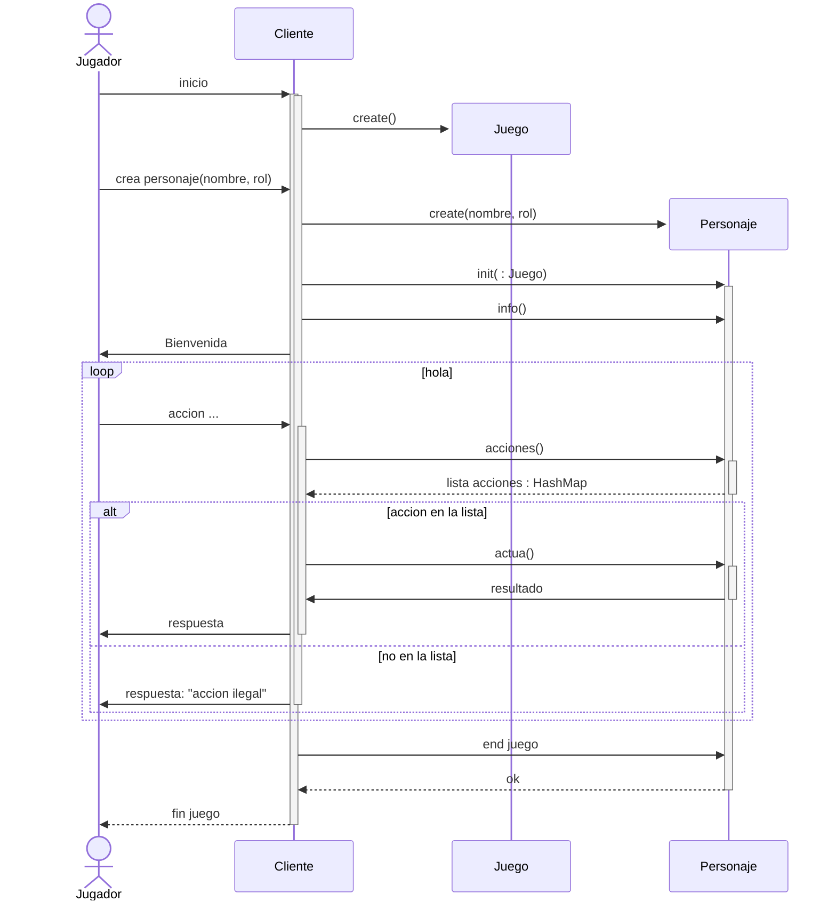

## Diagrama de secuencia de interacción del `Jugador` y el `Personaje`i

| Documento: | Módulo-3: MundiMap-SecuenciaPrincipalJugador                 |
| ---------- | ------------------------------------------------------------ |
| Curso:     | SISTEMAS DISTRIBUIDOS - Grado en Ingeniería Informática      |
| Libro:     | Enunciado Proyecto 2: Mapa del Mundo - Diagrama de Secuencia Principal de Jugador-Cliente-Personaje |
| Autor:     | LLAMAS BELLO, CESAR                                          |
| Fecha:     | lunes, 18 de mayo de 2024                                    |
| Versión:   | 1.0 - original - 05-18-2024                                  |

* El `Jugador` interacciona con la aplicación mediante un proceso `Cliente`, que puede estar en un host distinto al de la plataforma del juego.
* El `Cliente` se encarga de:
  * crear un `Juego` que desencadena la instanciación de un MundiMap y demás estructuras necesarias para mantener el sistema de juego.
  * crear un `Personaje` en función de lo indicado por el jugador en modo terminal o mediante argumentos respecto al `nombre` y el `rol` (wizard, ...).
  * interactuar en bucle con el jugador solicitando órdenes y las transmite al `Personaje`, que mantiene el **estado del juego para el jugador** en la plataforma.
* `Personaje` representa al `Jugador` en la plataforma y conoce qué operaciones son válidas en cada momento puesto que mantiene el estado:
  * La estancia en que se encuentra el personaje,
  * el estatus del personaje.
* El bucle de operaciones habituales del desarrollo del juego es este:
  1. El `Jugador` inserta una orden al juego por teclado. Si no es correcta sintácticamente la rechaza en primera instancia hasta que consigue una correcta sintácticamente.
  2. El `Cliente` consulta a `Personaje` para conocer las `acciones()` disponibles.
     1. Si la orden del `Jugador` está disponible `actua()`, y devuelve el resultado.
     2. Si la orden  del `Jugador` no está disponible se lo indica.
  3. Vuelve a por más órdenes (Paso 1.) salvo que sea la opción de salir.

 Catálogo de operaciones disponibles para el `Jugador` una vez iniciado el personaje y el juego.:

* `Query` (`Ask` | `Show`) `Me`: requiere que `Cliente` haya efectuado `info()` y requiere `stats()` de `Personaje`.
* `Query` (`Ask` | `Show`) `Place`: requiere que `Cliente` consulte `here()` de `Personaje`.
* `Query` (`Ask` | `Show`) `[<puerta>|<cofre>]`: se resuelve según la `lista_acciones` permitidas desde el `Personaje`.
* `Open` (`Activate` | `Disclose`) `[<puerta>|<cofre>]`: se resuelve según la `lista_acciones` permitidas desde el `Personaje`.
* `Exit` (`Abandon` | `Surrender`) : se resuelve en el `Cliente`.
* `Help`: se resuelve en el `Cliente`.

---

